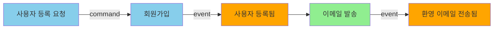
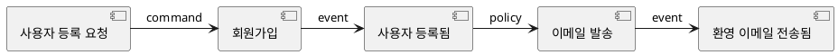

# Event Storming Tool - 소프트웨어 아키텍처 설계

## 📋 목차
1. [아키텍처 개요](#아키텍처-개요)
2. [계층별 상세 설계](#계층별-상세-설계)
3. [핵심 도메인 모델](#핵심-도메인-모델)
4. [데이터 흐름](#데이터-흐름)
5. [보안 설계](#보안-설계)
6. [기술 스택 추천](#기술-스택-추천)
7. [구현 체크리스트](#구현-체크리스트)

---

## 아키텍처 개요

### Hexagonal Architecture (Ports & Adapters)

**왜 이 아키텍처인가?**
- ✅ DDD 철학에 완벽히 부합: 도메인이 중심
- ✅ 기술 독립성: UI 프레임워크 변경해도 도메인 코드는 그대로
- ✅ 테스트 용이성: 도메인 로직을 Mock 없이 단위 테스트 가능
- ✅ 확장성: 새로운 Export 포맷 추가 시 도메인 수정 불필요

### 핵심 원칙
```
외부 계층 → 내부 계층 (의존성 방향)
Infrastructure → Application → Domain
UI → Application → Domain

Domain은 어떤 계층도 알지 못함!
```

---

## 계층별 상세 설계

### 1️⃣ **Domain Layer (Core)**
> **가장 중요! 비즈니스 로직의 순수한 표현**

#### 📦 Entities (엔티티)
```typescript
// domain/entities/Event.ts
class Event {
  private readonly id: EventId;
  private name: EventName;
  private position: Position;
  private type: EventType;
  private color: Color;
  
  constructor(props: EventProps) {
    this.validate(props);
    // ... 초기화
  }
  
  moveTo(newPosition: Position): void {
    // 비즈니스 규칙: 보드 경계 체크
    if (!newPosition.isWithinBounds()) {
      throw new DomainError('Position out of bounds');
    }
    this.position = newPosition;
  }
  
  changeName(newName: EventName): void {
    // 비즈니스 규칙: 이름 유효성
    if (newName.isEmpty()) {
      throw new DomainError('Event name cannot be empty');
    }
    this.name = newName;
  }
}

class Aggregate {
  private readonly id: AggregateId;
  private name: AggregateName;
  private events: Event[];
  private commands: Command[];
  
  addEvent(event: Event): void {
    // 비즈니스 규칙: 집합체 내 이벤트 관계 검증
    if (!this.canAddEvent(event)) {
      throw new DomainError('Event cannot be added to this aggregate');
    }
    this.events.push(event);
  }
}
```

#### 💎 Value Objects (값 객체)
```typescript
// domain/value-objects/Position.ts
class Position {
  constructor(
    private readonly x: number,
    private readonly y: number
  ) {
    if (x < 0 || y < 0) {
      throw new DomainError('Position cannot be negative');
    }
  }
  
  distanceTo(other: Position): number {
    return Math.sqrt(
      Math.pow(this.x - other.x, 2) + 
      Math.pow(this.y - other.y, 2)
    );
  }
  
  isWithinBounds(): boolean {
    // 보드 크기는 도메인 상수로 관리
    return this.x <= BOARD_MAX_WIDTH && this.y <= BOARD_MAX_HEIGHT;
  }
  
  equals(other: Position): boolean {
    return this.x === other.x && this.y === other.y;
  }
}

class EventType {
  private static readonly VALID_TYPES = [
    'domain-event', 'command', 'policy', 
    'external-system', 'aggregate', 'read-model'
  ] as const;
  
  constructor(private readonly value: string) {
    if (!EventType.VALID_TYPES.includes(value)) {
      throw new DomainError(`Invalid event type: ${value}`);
    }
  }
  
  getColor(): string {
    // Event Storming 표준 색상
    const colorMap = {
      'domain-event': '#FFA500',  // 오렌지
      'command': '#87CEEB',        // 하늘색
      'aggregate': '#FFD700',      // 노란색
      // ...
    };
    return colorMap[this.value];
  }
}
```

#### 🔧 Domain Services
```typescript
// domain/services/EventStormingBoard.ts
class EventStormingBoard {
  private events: Map<EventId, Event> = new Map();
  private aggregates: Map<AggregateId, Aggregate> = new Map();
  
  addEvent(event: Event): void {
    // 비즈니스 규칙: 위치 중복 체크
    if (this.hasOverlappingEvent(event.position)) {
      throw new DomainError('Event overlaps with existing event');
    }
    this.events.set(event.id, event);
  }
  
  detectAggregates(): Aggregate[] {
    // 비즈니스 로직: 근접한 이벤트들을 Aggregate로 그룹화
    const clusters = this.clusterEventsByProximity();
    return clusters.map(cluster => 
      Aggregate.fromEvents(cluster)
    );
  }
  
  validateFlow(): ValidationResult {
    // 비즈니스 규칙: Event Storming 흐름 검증
    // 예: Command → Event 순서, 시간순 배치 등
    const errors: string[] = [];
    
    // 모든 Command 뒤에 Event가 있는지 확인
    for (const event of this.events.values()) {
      if (event.type.isCommand()) {
        const nextEvent = this.findNextEvent(event);
        if (!nextEvent || !nextEvent.type.isDomainEvent()) {
          errors.push(`Command ${event.name} must be followed by an event`);
        }
      }
    }
    
    return new ValidationResult(errors);
  }
}
```

#### 🔌 Ports (인터페이스)
```typescript
// domain/ports/IEventRepository.ts
interface IEventRepository {
  save(board: EventStormingBoard): Promise<void>;
  load(boardId: BoardId): Promise<EventStormingBoard>;
  exists(boardId: BoardId): Promise<boolean>;
}

// domain/ports/IDiagramGenerator.ts
interface IDiagramGenerator {
  generateMermaid(board: EventStormingBoard): string;
  generatePlantUML(board: EventStormingBoard): string;
}

// domain/ports/IFileStorage.ts
interface IFileStorage {
  saveFile(path: string, content: string): Promise<void>;
  loadFile(path: string): Promise<string>;
  validatePath(path: string): boolean;
}
```

---

### 2️⃣ **Application Layer**
> **유스케이스 조율, 도메인 호출**

#### 명령(Commands) - CQRS Pattern
```typescript
// application/commands/CreateEventCommand.ts
class CreateEventCommand {
  constructor(
    public readonly boardId: string,
    public readonly name: string,
    public readonly type: string,
    public readonly x: number,
    public readonly y: number
  ) {}
}

class CreateEventHandler {
  constructor(
    private readonly repository: IEventRepository,
    private readonly eventBus: IEventBus
  ) {}
  
  async handle(command: CreateEventCommand): Promise<void> {
    // 1. 도메인 객체 생성
    const event = Event.create({
      name: new EventName(command.name),
      type: new EventType(command.type),
      position: new Position(command.x, command.y),
    });
    
    // 2. 보드 로드
    const board = await this.repository.load(
      new BoardId(command.boardId)
    );
    
    // 3. 도메인 로직 실행
    board.addEvent(event);
    
    // 4. 저장
    await this.repository.save(board);
    
    // 5. 이벤트 발행 (UI 갱신용)
    await this.eventBus.publish(
      new EventCreatedEvent(event.id, event.name)
    );
  }
}
```

#### 쿼리(Queries) - CQRS Pattern
```typescript
// application/queries/GetBoardStateQuery.ts
class GetBoardStateQuery {
  constructor(public readonly boardId: string) {}
}

interface BoardStateDTO {
  id: string;
  events: EventDTO[];
  aggregates: AggregateDTO[];
  lastModified: Date;
}

class GetBoardStateHandler {
  constructor(private readonly repository: IEventRepository) {}
  
  async handle(query: GetBoardStateQuery): Promise<BoardStateDTO> {
    const board = await this.repository.load(
      new BoardId(query.boardId)
    );
    
    // DTO로 변환 (프레젠테이션용 데이터 구조)
    return {
      id: board.id.value,
      events: board.events.map(e => this.toEventDTO(e)),
      aggregates: board.aggregates.map(a => this.toAggregateDTO(a)),
      lastModified: board.lastModified,
    };
  }
}
```

---

### 3️⃣ **Infrastructure Layer (Adapters)**

#### 파일 시스템 어댑터
```typescript
// infrastructure/adapters/FileSystemAdapter.ts
class FileSystemAdapter implements IFileStorage {
  private readonly basePath: string;
  
  async saveFile(path: string, content: string): Promise<void> {
    // 보안: Path Traversal 방지
    const safePath = this.sanitizePath(path);
    
    // 최소 권한: 필요한 권한만 요청
    await fs.promises.writeFile(
      safePath, 
      content, 
      { mode: 0o600 } // 소유자만 읽기/쓰기
    );
  }
  
  async loadFile(path: string): Promise<string> {
    const safePath = this.sanitizePath(path);
    
    // 보안: 파일 크기 제한 (10MB)
    const stats = await fs.promises.stat(safePath);
    if (stats.size > 10 * 1024 * 1024) {
      throw new SecurityError('File too large');
    }
    
    return await fs.promises.readFile(safePath, 'utf-8');
  }
  
  private sanitizePath(path: string): string {
    // 절대 경로 변환
    const resolved = path.resolve(this.basePath, path);
    
    // basePath 벗어나는지 체크
    if (!resolved.startsWith(this.basePath)) {
      throw new SecurityError('Path traversal detected');
    }
    
    return resolved;
  }
}
```

#### Import 어댑터 (보안 중점)
```typescript
// infrastructure/adapters/SecureImportAdapter.ts
class SecureImportAdapter {
  private readonly validator: SchemaValidator;
  private readonly sanitizer: DataSanitizer;
  
  async importFromJSON(filePath: string): Promise<EventStormingBoard> {
    // 1단계: 파일 검증
    await this.validateFile(filePath);
    
    // 2단계: 내용 로드
    const content = await this.fileStorage.loadFile(filePath);
    
    // 3단계: JSON 파싱 (안전하게)
    let data;
    try {
      data = JSON.parse(content);
    } catch (e) {
      throw new ImportError('Invalid JSON format');
    }
    
    // 4단계: 스키마 검증
    const validationResult = this.validator.validate(data, BoardSchema);
    if (!validationResult.isValid) {
      throw new ImportError(`Schema validation failed: ${validationResult.errors}`);
    }
    
    // 5단계: 데이터 Sanitization
    const sanitized = this.sanitizer.sanitize(data);
    
    // 6단계: 도메인 객체로 변환
    return this.toDomain(sanitized);
  }
  
  private async validateFile(filePath: string): Promise<void> {
    // 확장자 체크
    if (!filePath.endsWith('.json')) {
      throw new ImportError('Only JSON files are allowed');
    }
    
    // MIME 타입 체크
    const mimeType = await this.getMimeType(filePath);
    if (mimeType !== 'application/json') {
      throw new ImportError('Invalid file type');
    }
  }
}

// 스키마 정의 (JSON Schema)
const BoardSchema = {
  type: 'object',
  required: ['version', 'events'],
  properties: {
    version: { type: 'string', enum: ['1.0'] },
    events: {
      type: 'array',
      items: {
        type: 'object',
        required: ['id', 'name', 'type', 'position'],
        properties: {
          id: { type: 'string', pattern: '^[a-zA-Z0-9-]+$' },
          name: { type: 'string', maxLength: 200 },
          type: { type: 'string', enum: ['domain-event', 'command', ...] },
          position: {
            type: 'object',
            required: ['x', 'y'],
            properties: {
              x: { type: 'number', minimum: 0, maximum: 10000 },
              y: { type: 'number', minimum: 0, maximum: 10000 }
            }
          }
        }
      }
    }
  }
};
```

#### Export 어댑터
```typescript
// infrastructure/adapters/MermaidExportAdapter.ts
class MermaidExportAdapter implements IDiagramGenerator {
  generateMermaid(board: EventStormingBoard): string {
    let mermaid = 'graph LR\n';
    
    // 이벤트를 시간순으로 정렬
    const sortedEvents = board.events.sort((a, b) => 
      a.position.x - b.position.x
    );
    
    // Mermaid 구문 생성
    for (const event of sortedEvents) {
      const shape = this.getShapeForType(event.type);
      const color = event.type.getColor();
      
      mermaid += `  ${event.id}${shape}"${event.name}"]\n`;
      mermaid += `  style ${event.id} fill:${color}\n`;
    }
    
    // 연결선 추가
    for (let i = 0; i < sortedEvents.length - 1; i++) {
      mermaid += `  ${sortedEvents[i].id} --> ${sortedEvents[i+1].id}\n`;
    }
    
    return mermaid;
  }
  
  private getShapeForType(type: EventType): string {
    const shapeMap = {
      'domain-event': '[',    // 사각형
      'command': '([',        // 둥근 사각형
      'aggregate': '{{',      // 육각형
      // ...
    };
    return shapeMap[type.value] || '[';
  }
}
```

---

### 4️⃣ **Presentation Layer (UI)**

#### Electron 메인 프로세스
```typescript
// presentation/electron/main.ts
import { app, BrowserWindow, ipcMain } from 'electron';

let mainWindow: BrowserWindow;

app.on('ready', () => {
  mainWindow = new BrowserWindow({
    width: 1600,
    height: 1000,
    webPreferences: {
      nodeIntegration: false,  // 보안: Node.js API 분리
      contextIsolation: true,  // 보안: Context 격리
      preload: path.join(__dirname, 'preload.js')
    }
  });
  
  // IPC 핸들러 등록
  setupIPCHandlers();
});

function setupIPCHandlers() {
  // Command 처리
  ipcMain.handle('create-event', async (event, command) => {
    const handler = new CreateEventHandler(/* DI */);
    await handler.handle(command);
  });
  
  // Query 처리
  ipcMain.handle('get-board-state', async (event, query) => {
    const handler = new GetBoardStateHandler(/* DI */);
    return await handler.handle(query);
  });
  
  // Export 처리
  ipcMain.handle('export-pdf', async (event, { boardId, outputPath }) => {
    const handler = new ExportPDFHandler(/* DI */);
    await handler.handle(new ExportPDFCommand(boardId, outputPath));
  });
}
```

#### React UI (렌더러 프로세스)
```typescript
// presentation/react/components/EventStormingCanvas.tsx
import React, { useRef, useEffect, useState } from 'react';
import { Stage, Layer, Rect, Text } from 'react-konva';

interface EventViewModel {
  id: string;
  name: string;
  x: number;
  y: number;
  color: string;
}

const EventStormingCanvas: React.FC = () => {
  const [events, setEvents] = useState<EventViewModel[]>([]);
  const stageRef = useRef(null);
  
  // 보드 상태 로드
  useEffect(() => {
    loadBoardState();
  }, []);
  
  const loadBoardState = async () => {
    const state = await window.electronAPI.getBoardState('default');
    setEvents(state.events);
  };
  
  // 이벤트 생성
  const handleCanvasClick = async (e: KonvaEventObject<MouseEvent>) => {
    const pos = e.target.getStage().getPointerPosition();
    
    await window.electronAPI.createEvent({
      boardId: 'default',
      name: 'New Event',
      type: 'domain-event',
      x: pos.x,
      y: pos.y,
    });
    
    await loadBoardState(); // 재로드
  };
  
  // 드래그 처리
  const handleDragEnd = async (eventId: string, x: number, y: number) => {
    await window.electronAPI.moveEvent({
      boardId: 'default',
      eventId,
      newX: x,
      newY: y,
    });
  };
  
  return (
    <Stage 
      width={1600} 
      height={1000} 
      ref={stageRef}
      onClick={handleCanvasClick}
    >
      <Layer>
        {events.map(event => (
          <EventCard
            key={event.id}
            event={event}
            onDragEnd={(x, y) => handleDragEnd(event.id, x, y)}
          />
        ))}
      </Layer>
    </Stage>
  );
};

// Preload 스크립트 (보안 브리지)
// presentation/electron/preload.ts
import { contextBridge, ipcRenderer } from 'electron';

contextBridge.exposeInMainWorld('electronAPI', {
  createEvent: (command) => ipcRenderer.invoke('create-event', command),
  getBoardState: (boardId) => ipcRenderer.invoke('get-board-state', { boardId }),
  moveEvent: (command) => ipcRenderer.invoke('move-event', command),
  exportPDF: (boardId, path) => ipcRenderer.invoke('export-pdf', { boardId, outputPath: path }),
});
```

---

## 보안 설계

### 1. Import 보안 (3단계 방어)
```
파일 → [1. 파일 검증] → [2. 스키마 검증] → [3. Sanitization] → 도메인
```

#### 1단계: 파일 검증
- ✅ 확장자 화이트리스트 (.json만 허용)
- ✅ MIME 타입 검증
- ✅ 파일 크기 제한 (10MB)
- ✅ Path Traversal 방지

#### 2단계: 스키마 검증 (JSON Schema)
```json
{
  "type": "object",
  "required": ["version", "events"],
  "properties": {
    "version": { "type": "string", "enum": ["1.0"] },
    "events": {
      "type": "array",
      "maxItems": 1000,
      "items": {
        "type": "object",
        "required": ["id", "name", "type", "position"],
        "properties": {
          "id": { 
            "type": "string", 
            "pattern": "^[a-zA-Z0-9-]{1,50}$" 
          },
          "name": { 
            "type": "string", 
            "maxLength": 200,
            "minLength": 1
          },
          "type": { 
            "type": "string", 
            "enum": ["domain-event", "command", "policy", "aggregate", "external-system"]
          },
          "position": {
            "type": "object",
            "properties": {
              "x": { "type": "number", "minimum": 0, "maximum": 10000 },
              "y": { "type": "number", "minimum": 0, "maximum": 10000 }
            }
          }
        }
      }
    }
  }
}
```

#### 3단계: Sanitization
```typescript
class DataSanitizer {
  sanitize(data: any): SanitizedData {
    return {
      version: this.sanitizeString(data.version),
      events: data.events.map(e => ({
        id: this.sanitizeId(e.id),
        name: this.sanitizeString(e.name),
        type: this.sanitizeEnum(e.type, VALID_EVENT_TYPES),
        position: {
          x: this.sanitizeNumber(e.position.x, 0, 10000),
          y: this.sanitizeNumber(e.position.y, 0, 10000),
        }
      }))
    };
  }
  
  private sanitizeString(value: string): string {
    // HTML 태그 제거
    return value.replace(/<[^>]*>/g, '')
                .trim()
                .substring(0, 200);
  }
  
  private sanitizeId(value: string): string {
    // 영숫자와 하이픈만 허용
    return value.replace(/[^a-zA-Z0-9-]/g, '');
  }
}
```

### 2. 파일 시스템 보안
- ✅ Path Traversal 방지 (../../../etc/passwd)
- ✅ 최소 권한 (파일 권한 0o600)
- ✅ 작업 디렉토리 제한 (chroot 개념)

### 3. Electron 보안
- ✅ `nodeIntegration: false`
- ✅ `contextIsolation: true`
- ✅ `preload` 스크립트로 안전한 API만 노출
- ✅ Content Security Policy (CSP)

---

## 기술 스택 추천

### 필수 기술
```yaml
Runtime:
  - Node.js 18+ (LTS)
  - Electron 28+ (데스크톱 앱 프레임워크)

언어:
  - TypeScript 5+ (타입 안전성)

UI Layer:
  - React 18+ (UI 프레임워크)
  - Konva.js (Canvas 렌더링, 드래그&드롭)
  - Tailwind CSS (스타일링)

Domain/Application:
  - Pure TypeScript (외부 의존성 최소화)
  - Zod (런타임 스키마 검증)

Infrastructure:
  - Ajv (JSON Schema 검증)
  - DOMPurify (XSS 방지)
  - Puppeteer (스크린샷/PDF 생성)
  - file-type (MIME 타입 검증)

Testing:
  - Vitest (단위 테스트)
  - Playwright (E2E 테스트)
```

### 디렉토리 구조
```
event-storming-tool/
├── src/
│   ├── domain/                    # 🎯 핵심 도메인 (순수 TS)
│   │   ├── entities/
│   │   │   ├── Event.ts
│   │   │   ├── Aggregate.ts
│   │   │   └── Command.ts
│   │   ├── value-objects/
│   │   │   ├── Position.ts
│   │   │   ├── EventType.ts
│   │   │   └── EventName.ts
│   │   ├── services/
│   │   │   ├── EventStormingBoard.ts
│   │   │   └── FlowValidator.ts
│   │   └── ports/                  # 인터페이스
│   │       ├── IEventRepository.ts
│   │       ├── IDiagramGenerator.ts
│   │       └── IFileStorage.ts
│   │
│   ├── application/                # 유스케이스
│   │   ├── commands/
│   │   │   ├── CreateEventCommand.ts
│   │   │   ├── CreateEventHandler.ts
│   │   │   ├── MoveEventCommand.ts
│   │   │   └── DeleteEventCommand.ts
│   │   ├── queries/
│   │   │   ├── GetBoardStateQuery.ts
│   │   │   ├── GetBoardStateHandler.ts
│   │   │   └── ExportQuery.ts
│   │   └── services/
│   │       └── ApplicationService.ts
│   │
│   ├── infrastructure/             # 어댑터 구현
│   │   ├── adapters/
│   │   │   ├── FileSystemAdapter.ts
│   │   │   ├── InMemoryRepository.ts
│   │   │   ├── MermaidExportAdapter.ts
│   │   │   ├── PlantUMLExportAdapter.ts
│   │   │   ├── PDFExportAdapter.ts
│   │   │   └── SecureImportAdapter.ts
│   │   └── security/
│   │       ├── SchemaValidator.ts
│   │       ├── DataSanitizer.ts
│   │       └── PathSanitizer.ts
│   │
│   ├── presentation/               # UI 계층
│   │   ├── electron/
│   │   │   ├── main.ts
│   │   │   ├── preload.ts
│   │   │   └── ipcHandlers.ts
│   │   └── react/
│   │       ├── components/
│   │       │   ├── EventStormingCanvas.tsx
│   │       │   ├── EventCard.tsx
│   │       │   ├── Toolbar.tsx
│   │       │   └── ExportDialog.tsx
│   │       ├── hooks/
│   │       │   └── useBoard.ts
│   │       └── App.tsx
│   │
│   └── shared/                     # 공통 유틸
│       ├── errors/
│       └── types/
│
├── tests/
│   ├── domain/                     # 도메인 단위 테스트
│   ├── application/                # 통합 테스트
│   └── e2e/                        # E2E 테스트
│
└── package.json
```

---

## 구현 체크리스트

### Phase 1: 핵심 도메인 (1-2주)
- [ ] **Value Objects 구현**
    - [ ] Position (좌표)
    - [ ] EventType (이벤트 타입)
    - [ ] EventName (이벤트 이름)
    - [ ] Color (색상)

- [ ] **Entities 구현**
    - [ ] Event (이벤트 카드)
    - [ ] Aggregate (집합체)
    - [ ] Command (명령)

- [ ] **Domain Services**
    - [ ] EventStormingBoard (보드 관리)
    - [ ] FlowValidator (흐름 검증)
    - [ ] AggregateDetector (집합체 자동 감지)

- [ ] **도메인 단위 테스트**
    - [ ] 모든 비즈니스 규칙 테스트
    - [ ] 경계값 테스트
    - [ ] 불변성 테스트

### Phase 2: Application Layer (1주)
- [ ] **Commands 구현**
    - [ ] CreateEventCommand + Handler
    - [ ] MoveEventCommand + Handler
    - [ ] DeleteEventCommand + Handler
    - [ ] UpdateEventCommand + Handler

- [ ] **Queries 구현**
    - [ ] GetBoardStateQuery + Handler
    - [ ] GetEventQuery + Handler
    - [ ] ExportQuery + Handler

- [ ] **Application Services**
    - [ ] 트랜잭션 관리
    - [ ] DTO 변환

- [ ] **통합 테스트**
    - [ ] 유스케이스 시나리오 테스트

### Phase 3: Infrastructure (1-2주)
- [ ] **Repository 구현**
    - [ ] InMemoryRepository (개발용)
    - [ ] FileSystemRepository (프로덕션)

- [ ] **Export Adapters**
    - [ ] MermaidExportAdapter
    - [ ] PlantUMLExportAdapter
    - [ ] PDFExportAdapter (Puppeteer)
    - [ ] PNGExportAdapter (Canvas → PNG)

- [ ] **Import Adapter (보안)**
    - [ ] SchemaValidator (JSON Schema)
    - [ ] DataSanitizer
    - [ ] SecureImportAdapter

- [ ] **파일 시스템**
    - [ ] FileSystemAdapter
    - [ ] PathSanitizer (보안)

- [ ] **보안 테스트**
    - [ ] Path Traversal 공격 테스트
    - [ ] 악의적 JSON 테스트
    - [ ] 대용량 파일 테스트

### Phase 4: Presentation (2주)
- [ ] **Electron 설정**
    - [ ] 메인 프로세스 설정
    - [ ] Preload 스크립트 (보안)
    - [ ] IPC 핸들러

- [ ] **React UI**
    - [ ] EventStormingCanvas (Konva.js)
    - [ ] EventCard (드래그 가능한 카드)
    - [ ] Toolbar (도구 모음)
    - [ ] ExportDialog (내보내기 대화상자)
    - [ ] ImportDialog (가져오기 대화상자)

- [ ] **상태 관리**
    - [ ] useBoard hook
    - [ ] 낙관적 UI 업데이트

- [ ] **E2E 테스트**
    - [ ] 이벤트 생성/이동/삭제
    - [ ] 파일 저장/로드
    - [ ] Export 기능

### Phase 5: 마무리 (1주)
- [ ] **문서화**
    - [ ] README.md
    - [ ] 아키텍처 문서
    - [ ] API 문서

- [ ] **빌드 & 패키징**
    - [ ] Electron Builder 설정
    - [ ] Windows/Mac/Linux 빌드

- [ ] **성능 최적화**
    - [ ] Canvas 렌더링 최적화
    - [ ] 대량 이벤트 처리 (1000+ 개)

- [ ] **보안 검토**
    - [ ] CSP 설정
    - [ ] 권한 최소화 확인
    - [ ] 침투 테스트

---

## 📊 데이터 흐름 예시

### 시나리오: 사용자가 새 이벤트 생성
```
[사용자 클릭]
    ↓
[React EventStormingCanvas]
  → handleCanvasClick(x, y)
    ↓
[Electron IPC]
  → ipcRenderer.invoke('create-event', { boardId, name, type, x, y })
    ↓
[Main Process IPC Handler]
  → CreateEventCommand 생성
    ↓
[Application Layer - CreateEventHandler]
  → Repository에서 Board 로드
  → Domain: Event.create() 호출
  → Domain: board.addEvent(event) 호출
    → 비즈니스 규칙 검증 (위치 중복, 경계 체크)
  → Repository에 저장
  → EventCreatedEvent 발행
    ↓
[Infrastructure - InMemoryRepository]
  → 메모리에 저장
    ↓
[UI 자동 갱신]
  → GetBoardStateQuery 실행
  → Canvas 리렌더링
```

### 시나리오: JSON 파일 Import (보안 중점)
```
[사용자가 파일 선택]
    ↓
[ImportDialog]
  → electronAPI.importFromFile(filePath)
    ↓
[SecureImportAdapter]
  1. validateFile(filePath)
     → 확장자 체크: .json ✓
     → MIME 타입 체크: application/json ✓
     → 파일 크기: < 10MB ✓
     
  2. loadFile(filePath)
     → PathSanitizer: Path Traversal 방지 ✓
     → FileSystem: 파일 읽기
     
  3. JSON.parse()
     → try-catch로 안전하게 파싱
     
  4. SchemaValidator.validate()
     → JSON Schema 검증 ✓
     → 모든 필드 타입 확인 ✓
     
  5. DataSanitizer.sanitize()
     → HTML 태그 제거
     → 특수문자 필터링
     → 길이 제한 적용
     
  6. toDomain()
     → 도메인 객체로 변환
     → 도메인 규칙 재검증
     
  7. Repository.save()
     → 저장 완료!
```

---

## 🎨 Export 포맷 예시

### Mermaid Diagram


### PlantUML


### JSON (Import/Export 포맷)
```json
{
  "version": "1.0",
  "metadata": {
    "created": "2026-02-16T10:30:00Z",
    "author": "user@example.com"
  },
  "events": [
    {
      "id": "evt-001",
      "name": "사용자 등록 요청",
      "type": "command",
      "position": { "x": 100, "y": 200 },
      "color": "#87CEEB",
      "description": "사용자가 회원가입 폼을 제출함"
    },
    {
      "id": "evt-002",
      "name": "회원가입",
      "type": "command",
      "position": { "x": 300, "y": 200 },
      "color": "#87CEEB"
    },
    {
      "id": "evt-003",
      "name": "사용자 등록됨",
      "type": "domain-event",
      "position": { "x": 500, "y": 200 },
      "color": "#FFA500"
    }
  ],
  "aggregates": [
    {
      "id": "agg-001",
      "name": "User",
      "events": ["evt-001", "evt-002", "evt-003"],
      "bounds": { "x": 80, "y": 150, "width": 450, "height": 150 }
    }
  ]
}
```

---

## 🔍 핵심 설계 결정 요약

### ✅ 왜 Hexagonal Architecture인가?
- 도메인이 외부 기술에 **완전히 독립적**
- UI 프레임워크를 React → Vue → Svelte로 바꿔도 도메인 코드는 **0% 변경**
- 테스트 시 Mock 없이 순수 도메인 로직만 테스트 가능

### ✅ 왜 CQRS 패턴인가?
- 읽기(Query)와 쓰기(Command)를 분리
- 읽기는 단순하고 빠르게 (DTO 직접 반환)
- 쓰기는 비즈니스 규칙 엄격하게 검증
- 향후 Event Sourcing 도입 시 자연스럽게 확장 가능

### ✅ 왜 InMemory Repository인가?
- 단일 사용자이므로 DB 불필요
- 즉각적인 성능 (메모리 접근)
- 파일로 저장/로드하여 영속성 확보
- 추후 협업 기능 추가 시 DB로 교체 용이 (Port만 바꾸면 됨)

### ✅ 보안 설계의 3단계 방어
1. **파일 검증**: 확장자, MIME, 크기, 경로
2. **스키마 검증**: JSON Schema로 구조 검증
3. **Sanitization**: 악의적 데이터 제거

→ **Defense in Depth** 원칙

---

## 🚀 다음 단계

이제 구현을 시작하실 수 있습니다! 다음 중 하나를 선택해주세요:

1. **도메인 코드 작성부터 시작** (추천)
    - Event, Position, EventType 등 핵심 모델 구현

2. **프로젝트 초기 설정**
    - package.json, tsconfig.json, 디렉토리 구조 생성

3. **특정 부분 상세 설명**
    - 예: "MermaidExportAdapter 구현 코드 전체를 보여줘"

4. **아키텍처 다이어그램 수정**
    - 더 추가하고 싶은 컴포넌트가 있으신가요?

어떤 것부터 도와드릴까요? 😊
</doc>